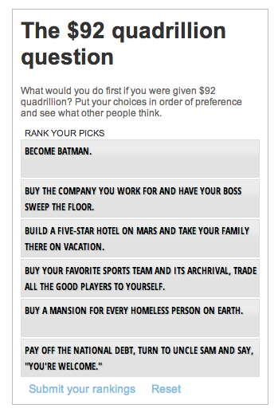

Quadrillion 
========================

What is this?
-------------
An app that allows users to rank and vote on what they would do if they suddenly landed a quadrillion dollars. [The story](http://www.mercurynews.com/ci_23680855/) ran in July 2013.
http://data.digitalfirstmedia.com/quadrillion/quadrillion.html

It is a reuse of the Ranker app:
http://data.digitalfirstmedia.com/ranker/ranker.html

Credits
---------
Peggy Bustamante

Assumptions
-----------

* JQuery
* Miso

What's in here?
---------------

The project contains the following folders and important files:

* ``quadrillion.html`` -- main file.
* ``JS`` -- ranker.js has all the action and business logic.
* ``data`` -- Data files, in a csv format and also a SQL dump of the vote count.
* ``incl`` -- PHP file "ranker.php" for recording user's selections/votes
* ``css`` -- Base css files to get rolling with.

License
----------

This code is available under the MIT license. For more information, please see the LICENSE.txt file in this repo.
